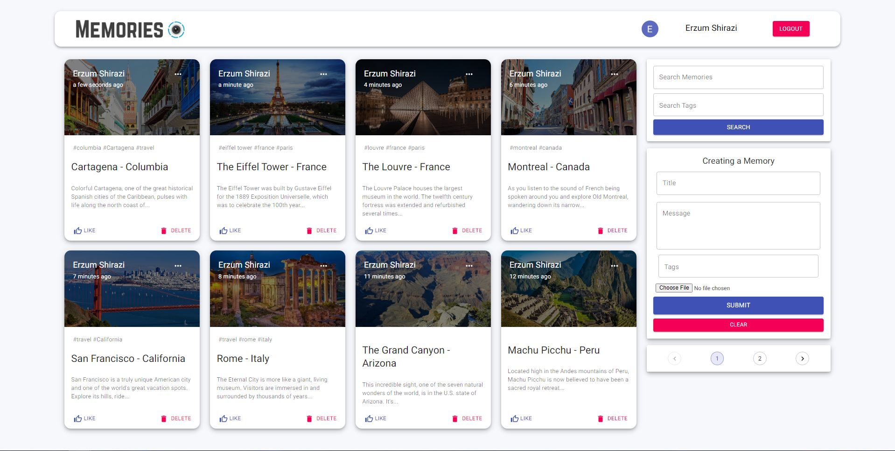
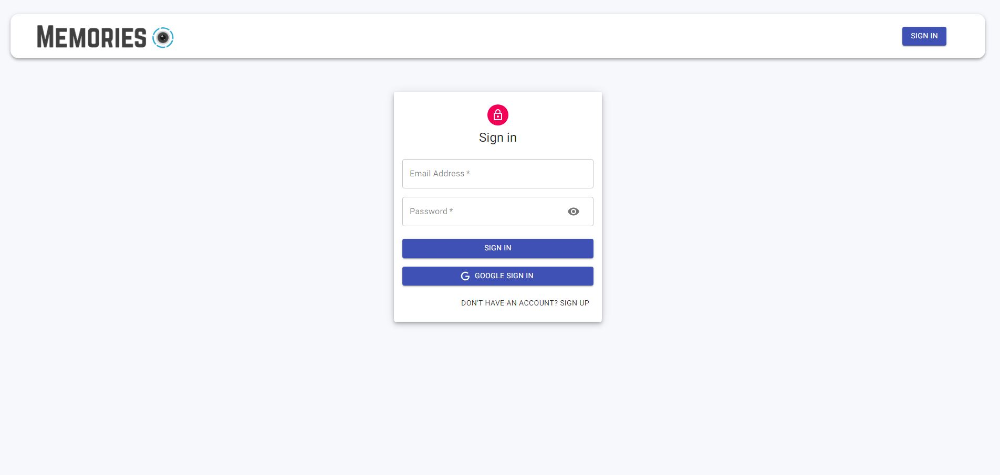
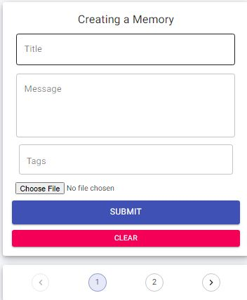
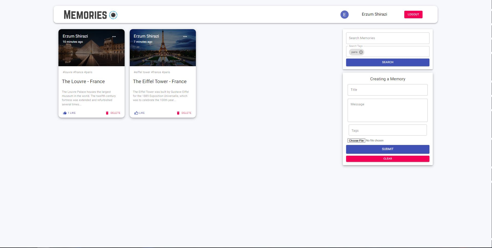
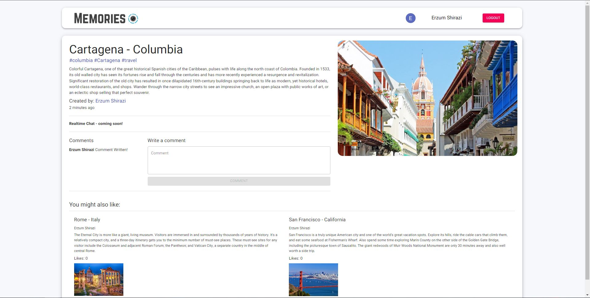
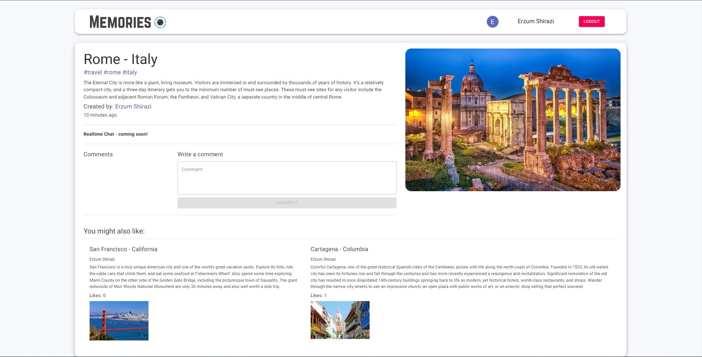

# Memories

## Introduction

Using MERN (MongoDB, Express, React, Node.js) "Memories" was created. This app is a simple social media app that allows users to post interesting events that happened in their lives.

## MERN Uses
**MongoDB**
     * Database used to store posts & Username/Password if the account is created through the website rather than google auth
**Express**
     * Used to create server-side web application & help manage server/routes
**React**
     * Used to build client-side interface
**Node.js**
     * Used as the back-end API service for non-blocking, event-driven servers due to its single-threaded nature

## Features

     * User-Authentication
          Done through importing GoogleLogin from 'react-google-login' or by searching database for existing username/pass by first checking bcrypt hashed passwords
   
         
     * Posting (With / Without image | Timestamped)
          
     * Liking / Unliking
          
     * Browsing (Through Searching Memories, Searching Tags, Or By Page)
          
     * Commenting On Posts
          
     * "You Might Also Like:" Recommended Posts Feature
          
